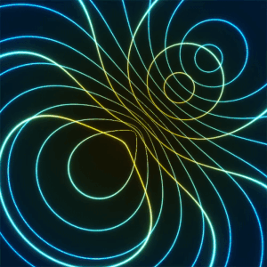
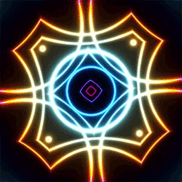

# ShaderToy port
## A tool to execute ShaderToy GLSL code on a local machine

This project is based on the following series of [tutorials](https://www.youtube.com/watch?v=wPOw5jK-Jn8&list=PLi-ukGVOag_2FRKHY5pakPNf9b9KXaYiD&ab_channel=Holistic3D).

Shaders in OpenGL offer the opportunity to create captivating art by manipulating graphical elements in real-time.
These small programs, executed on the GPU, provide control over rendering aspects like colors, lighting, and textures.
With shaders, artists and developers can push the boundaries of traditional graphics, exploring pixel-level manipulation, 
shape deformation, and texture blending. By understanding OpenGL programming and basic graphics concepts, you can embark on a journey of crafting unique visual experiences through various shader techniques. 🎨🖌️✨

[ShaderToy](https://shadertoy.com/) is an online community and tool for creating and sharing shaders through WebGL, used for both learning and teaching 3D computer graphics in a web browser.
Users can write code on a Web IDE and view the result in real time.
This tool should allow code written in ShaderToy to run on a local machine using Python.

<hr/>

## Progress
- [x] Execute `.vs` files
- [ ] Automate the porting of `.vs` files
- [ ] Specify window resolution as an argument
- [ ] Extra features (TBD)<br>
...

<hr/>

## Setup instructions
Clone the git-repo first:
```sh
$ git clone https://github.com/gregorio-talevi/shadertoy-port.git
```
Install dependencies:
```sh
$ pip install -r requirements.txt
```


## Porting ShaderToy code

Open the .vs file containing GLSL code and add the following lines at the top:
```glsl
#version 330 core
in vec2 frag_coord;
uniform float iTime;
uniform vec2 iResolution;
uniform vec2 iMouse;
out vec4 frag_color;
```

Modify the main header like this:

```cpp
mainImage( out vec4 fragColor, in vec2 fragCoord ) --> main()
```

Change each instance of "fragColor" and "fragCoord" to "frag_color" and "frag_coord" respectively:

```cpp
fragColor --> frag_color
fragCoord --> frag_coord
```

## Running the code
Simply pass the file path `.vs` as an argument to `main.py`.

```sh
$ cd shadertoy-port
$ python main.py "path/to/file.vs"
```


## Examples

Try running one of the following examples to get an idea of what can be done with OpenGL shaders:

```sh
$ python main.py "./shaders/examples/hoop_loop.vs"
```



```sh
$ python main.py "./shaders/examples/turning_glow.vs"
```


